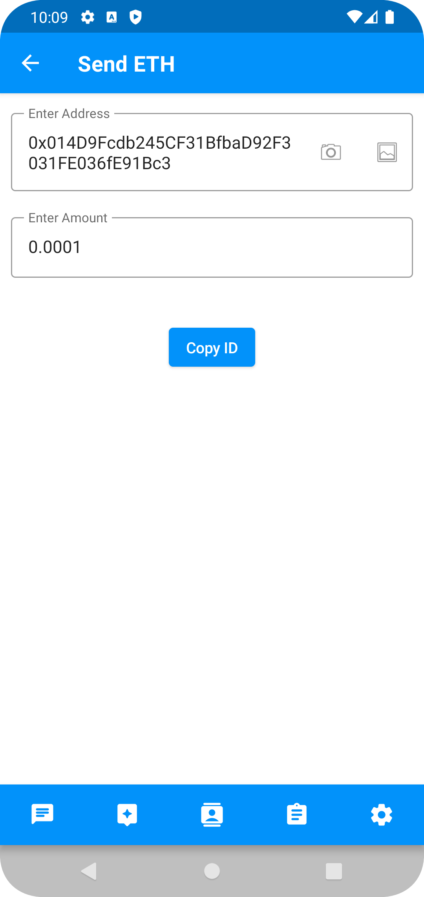

# OpenAiX

Welcome to our Public AI Chat Assistant App repository! This project aims to create a user-friendly chat application
with an AI assistant powered by advanced natural language processing (NLP) techniques. With this app, users can engage
in conversations, ask questions, and receive helpful responses from our AI assistant.

Open is now developing privately in a private repo project represented by this Repo. This project aims to combine Open's
infrastructure with AI & communications technology.

- [Technology implementation](#technology-implementation)
    - [Kotlin used](#kotlin-used)
    - [KMP used](#kotlin-multi-platform-used)
    - [Solution architecture](#solution-architecture)

## Technology implementation

### Kotlin

Kotlin is a modern but already mature programming language designed to make developers happier. It's concise, safe,
interoperable with Java and other languages, and provides many ways to reuse code between multiple platforms for
productive programming.

### Kotlin Multi Platform

The Kotlin Multiplatform technology is designed to simplify the development of cross-platform projects. It reduces time
spent writing and maintaining the same code for different platforms while retaining the flexibility and benefits of
native programming.

### Solution architecture

## 🌐 API

- Authentication
    - [x] Registration User
    - [x] Login User
    - [x] Forgot Password
    - [x] Change Password

- Chats
    - [x] User can create group chats
    - [x] User can create private chats
    - [ ] Private audio and video calls
    - [ ] Group audio and video calls
    - [ ] an other

- AI Assistant
    - [x] User can create chat with AI assistant
    - [x] User can get reminders from chat history
    - [x] User can get tasks from chat history
    - [x] User can get notes from chat history
    - [ ] Get summary of video and audio calls

- Wallets:
    - [x] User can create a noncustodial wallets
    - [x] User can view wallet balance
    - [x] User can send and receive crypto
    - [x] User can view transaction history
    - [x] User can view wallet address and scan QR code
    - [x] User can view wallet balance in fiat

## 📷 Screenshots

<ul>
<li><a href="#android-screenshots">Android</a></li>
</ul>

[<a href="#top">Back to top</a>]

### Android Screenshots

- [Authenticate](#android-authentication-screens)
- [Home](#android-home-screens)
- [Chats](#android-chats-screens)
- [AI Assistant](#android-chat-assistant-screens)
- [Settings](#android-settings-screens)
- [Wallet](#)
    - [Wallets Receive](#android-wallets-receive-screens)
    - [Wallets Send](#android-wallets-send-screens)

#### Android Authentication Screens

<table style="width:100%">
  <tr>
    <th>Registration Screen</th> 
    <th>Login Screen</th>
  </tr>
  <tr>
    <td></td>
    <td></td> 
  </tr>
</table>

#### Android Home Screens

<table style="width:100%">
  <tr>
    <th>Home Screen</th>
  </tr>
  <tr>
    <td></td>
  </tr>
</table>

#### Android Chats Screens

<table style="width:100%">
  <tr>
    <th>Contacts Screen</th>
    <th>Private Chat Screen</th> 
    <th>Group Chat Add member Screen</th>
    <th>Group Chat Detail Screen</th>
    <th>Group Chat Screen</th>
  </tr>
  <tr>
    <td></td>
    <td></td>
    <td></td> 
    <td></td> 
    <td></td> 
  </tr>
</table>

#### Android Chat Assistant Screens

<table style="width:100%">
  <tr>
    <th>AI Assistant Screen</th>
    <th>AI extracted task Screen</th>
  </tr>
  <tr>
    <td></td>
    <td></td>
  </tr>
</table>

#### Android Settings Screens

<table style="width:100%">
  <tr>
    <th>Settings Screen</th>
  </tr>
  <tr>
    <td></td>
  </tr>
</table>

#### Android Wallets Receive Screens

<table style="width:100%">
  <tr>
    <th>Wallet Generate Screen</th>
    <th>Wallet List Screen</th>
    <th>Wallet Detail Screen</th>
    <th>Wallet Receive Screen</th>

  </tr>
  <tr>
    <td></td>
    <td></td>
    <td></td>
    <td></td>
  </tr>
</table>

#### Android Wallets Send Screens

<table style="width:100%">
  <tr>
    <th>Wallet Send Biometric Screen</th>
    <th>Wallet Send Authenticated Screen</th>
    <th>Wallet Send Copy hash Screen</th>
    <th>Wallet Push Screen</th>
  </tr>
  <tr>
    <td></td>
    <td></td>
    <td></td>
    <td></td>
  </tr>
</table>

---
